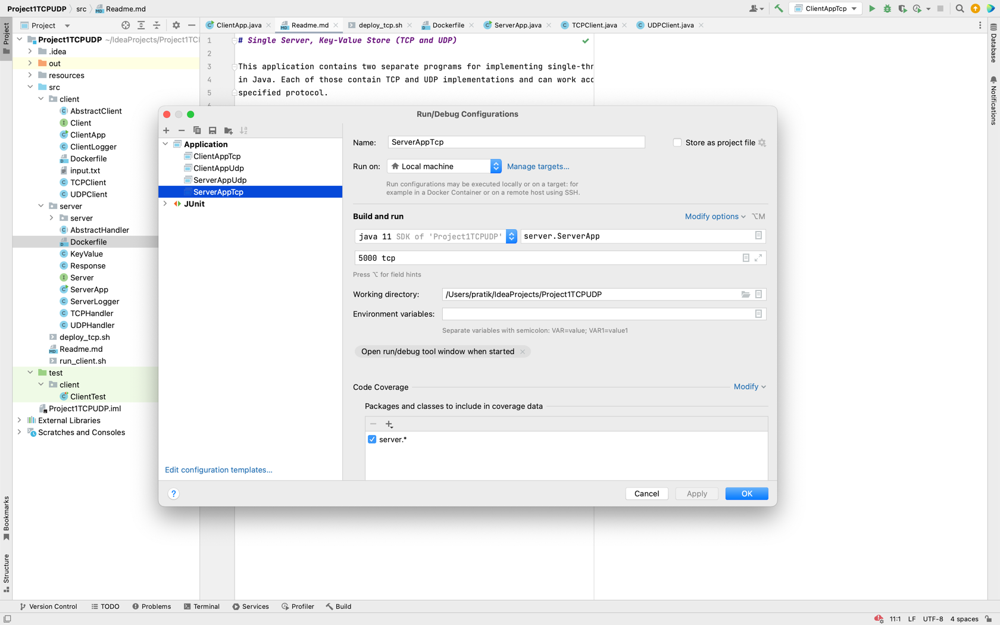

# Single Server, Key-Value Store (TCP and UDP)

This application contains two separate programs for implementing single-threaded Server and Client
in Java. Each of those contain TCP and UDP implementations and can work according to the user
specified protocol.

Steps to run the Server program using intellij IDE :

1. Add run configurations for server as below (please create one configuration each for TCP and
   UDP servers):

2. Provide arguments in the form of '`<port-number>` `<space>` `<protocol>`'. Port number can be any
   unused port
   number in the local machine and protocol needs to be 'tcp' for the TCP implementation or 'udp'
   for the UDP implementation.
3. Run the server using PLAY button on the intellij, which will open a run console where logs are
   visible.
   
4. Now you can proceed to start respective client program according to the protocol for which server
   has started.

Steps to run the Client program using intellij IDE :

1. Add run configurations for client as below (please create one configuration each for TCP and
   UDP clients):
   

2. Provide arguments in the form of '`<hostname>` `<space>` `<port-number>` `<space>` `<protocol>`'.
   Value for hostname is '
   localhost' for local computer. Port number can be any unused port number in the local machine and
   protocol needs to be 'tcp' for the TCP implementation or 'udp' for the UDP implementation.
3. Run the server using PLAY button on the intellij, which will open a run console where logs are
   visible.
   
4. At this time you should be able to see the logs as below when both server and clients are up:

- For TCP server and client
  

- For UDP server and client
  

### Operations supported by client:

- All the values for `key` and `value` are inputted as String in the
  application [Note these string values must not contain a `:`]
- PUT operation used to insert new key-value pair onto the server -
  PUT:`<key>`:`<value>` [Note : Application uses colon ':' only as delimiter, anything else will be treated as invalid input]
- GET operation used to fetch the value for the key given from the server - GET:`<key>`
- DELETE operation used to delete the key-value pair for the key given from the server -
  DELETE:`<key>`
- `exit` to stop the client. In TCP application, this operation will close out TCP client then TCP
  server will exit since there was an active continuous connection present like:
  

In UDP application, exit operation will only stop the client but server will keep running
indefinitely until interrupted/stopped by IDE controls like:

- To demo `timeouts` on the server, special input `wait` is present that will indicate the server to
  wait for 5 seconds which exceeds the default timeout in this application for a server to respond
  to client. If the input string contains `wait` as a part or only `wait` as input then this
  condition is invoked.
  In this case, for tcp connections, client logs Server timed out! then exits the program since it
  is an connection-oriented protocol. As a result server also exits since connection is broken now.
  
  For udp connections, client does not wait for server response as it has already timed out but
  continues to take further inputs and tries to send again to the server since it is a
  connectionless protocol.
- If name of the operation inputted incorrectly like any other string then client validates and asks
  to enter input again. 
- Client is expected to take in any string for a valid operation (GET, PUT, DELETE, exit, wait)
  then `key` and `value` as input and passes it to the server for validations or correct operations
- If any other delimiter is used apart from `:` then client says enetered input was incorrect and
  asks for another set of inputs.
- Client logs all the responses received by the server including `timestamp`, `server ip`
  and `server port` in UDP. Server details are not logged in TCP client since it will remain the
  same throughout and connection is established from the ip and port provided by the client user
  itself.
- Client logs when starting and closing the client program.

### Operations supported by client

- Server will accept an input where `key` or/and `value` are not blank, and if blank then responds
  as Invalid Request! and logs malformed packet received
  
- Name of the operation needs to be in upper/lowercase as `PUT`, `GET`, `DELETE` followed by
  colon `:` and key and if value required.
- For `PUT`, `key` and `value` both are expected to be provided delimited by `:` else server will
  reject the request as Invalid Request!
  
- For `PUT`, if valid key-value pair provided then server responds as
  below 
- For `PUT`, if key-value already exists in the server then Server responds as Value overriden for
  the given key.
  
- For `GET` , `key` is expected to be provided delimited by `:` else server will reject the request
  as Invalid Request!
  
- For `GET`, if value is present for the key then server responds as
  below 
- For `GET`, if value not present for requested key then server responds as
  below 
- For `DELETE` , `key` is expected to be provided delimited by `:` else server will reject the
  request as Invalid Request!
  
- For `DELETE` , if key is present then server deletes the value and responds as
  below 
- For `DELETE` , if key is not present then server says could not find the value and responds as
  below 
- Server logs all the requests received from the client and responses that it is going to send back
  to the client with `timestamp`, `client ip` and `client port` in UDP server. Client details are
  not logged in TCP client since it will remain the same throughout and connection is established
  from the server's ip and port itself which will be provided by server user.

#### For demo purposes, a set of inputs are provided to test above-mentioned cases and will run when

#### Server starts and then client starts. Input is provided as a text file (input.txt) which is

#### read by client and passed on one by one to the server that fulfils the purpose of demo of

#### atleast 5 Put, 5 Get, 5 Delete and some extra conditions.

## Demo using Docker images of server and client

### TCP Demo

- There are two shell scripts provided in the source code named as `deploy_tcp.sh`
  and `run_client.sh` that will be used for this demo.
- First start the Docker engine on the local machine.
- Open Terminal or Shell command line, then cd into the location where above two scripts exist.
- Execute `sh deploy_tcp.sh` which will create server and client images from the source code, then
  bring up the server container on port 5555 as below
  
- Port number can be changed from docker run command in deploy_tcp.sh if required. It got
  complicated if I took it as a parameter on run-time so I preferred to hard-code it.
- Now, open another terminal window and execute `sh run_client.sh` which will bring up the client
  container to listen to port 5555 in localhost where server is exposed as below
  
- When both containers are up, client will show logs as per requests received from the client and
  perform operations in same way as it does in Intellij.
- When client needs to stopped, same `exit` command can be used to shut down client container then
  server container as is the behaviour on local machine. 
- The way this demo is implemented through docker is, Docker's internal network is not used to get
  the server and client conatiners to interact. Rather, server container is exposed to a port on
  localhost then client listens to that port on local machine.

#### UDP Demo

- I tried implementing UDP demo in the similar way as TCP is done through docker, but due to issues
  with creating and using internal networks, it could not be accomplished.