# Single Server, Key-Value Store (TCP and UDP)

This application contains two separate programs for implementing single-threaded Server and Client
in Java. Each of those contain TCP and UDP implementations and can work according to the user
specified protocol.

Steps to run the Server program using intellij IDE :

1. Add run configurations for server as below (please create one configuration each for TCP and
   UDP servers):

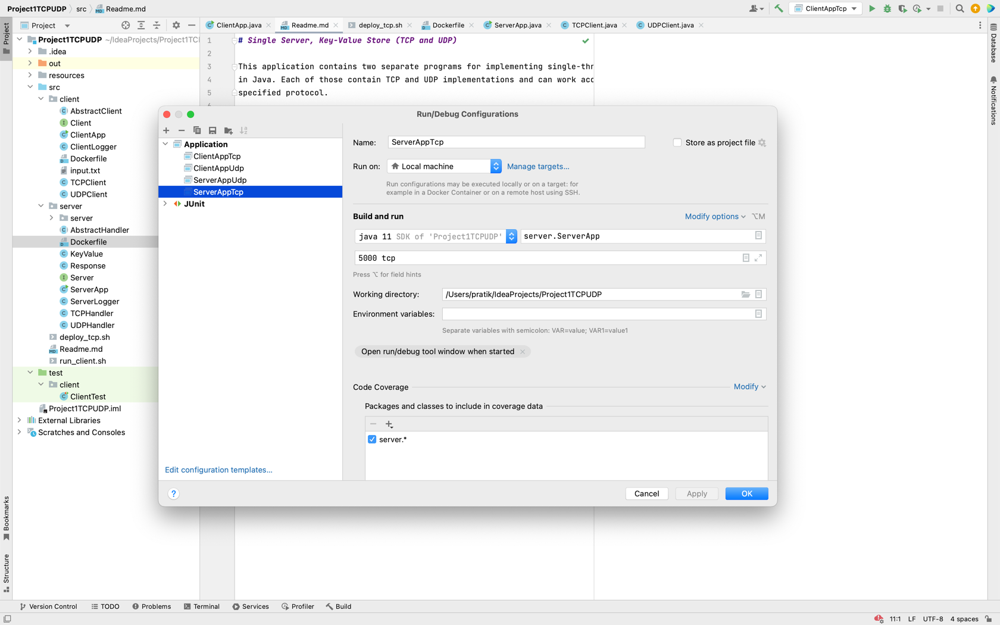

2. Provide arguments in the form of '`<port-number>` `<space>` `<protocol>`'. Port number can be any
   unused port
   number in the local machine and protocol needs to be 'tcp' for the TCP implementation or 'udp'
   for the UDP implementation.
3. Run the server using PLAY button on the intellij, which will open a run console where logs are
   visible.
   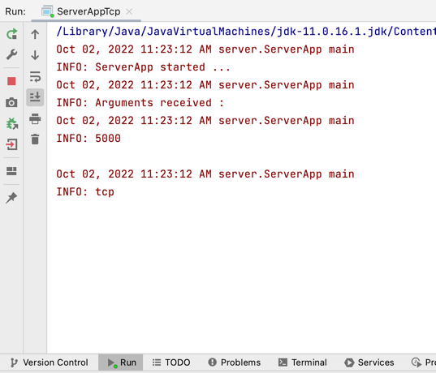
4. Now you can proceed to start respective client program according to the protocol for which server
   has started.

Steps to run the Client program using intellij IDE :

1. Add run configurations for client as below (please create one configuration each for TCP and
   UDP clients):
   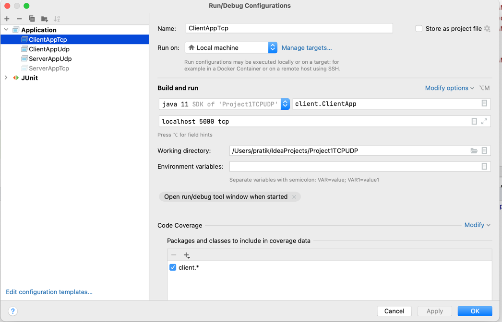

2. Provide arguments in the form of '`<hostname>` `<space>` `<port-number>` `<space>` `<protocol>`'.
   Value for hostname is '
   localhost' for local computer. Port number can be any unused port number in the local machine and
   protocol needs to be 'tcp' for the TCP implementation or 'udp' for the UDP implementation.
3. Run the server using PLAY button on the intellij, which will open a run console where logs are
   visible.
   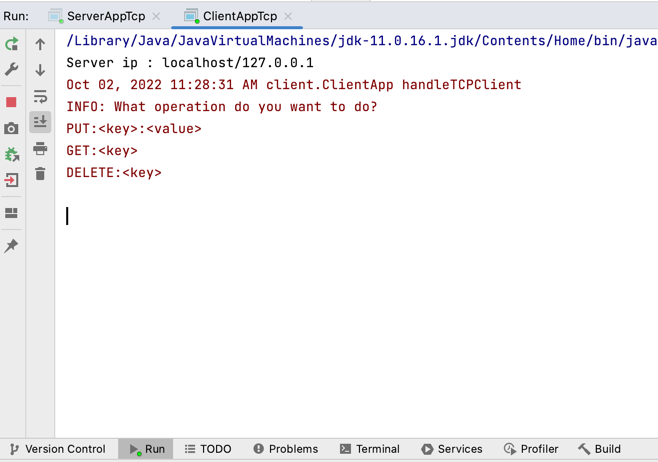
4. At this time you should be able to see the logs as below when both server and clients are up:

- For TCP server and client
  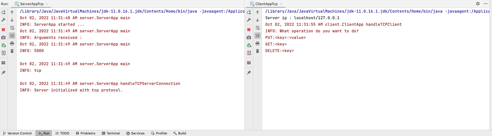

- For UDP server and client
  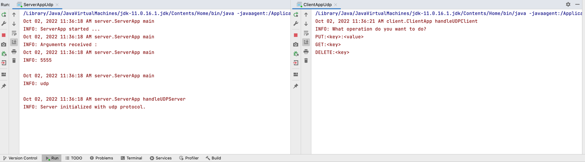

### Operations supported by client:

- All the values for `key` and `value` are inputted as String in the application.
- PUT operation used to insert new key-value pair onto the server -
  PUT:`<key>`:`<value>` [Note : Application uses colon ':' only as delimiter, anything else will be treated as invalid input]
- GET operation used to fetch the value for the key given from the server - GET:`<key>`
- DELETE operation used to delete the key-value pair for the key given from the server -
  DELETE:`<key>`
- `exit` to stop the client. In TCP application, this operation will close out TCP client then TCP
  server will exit since there was an active continuous connection present like:
  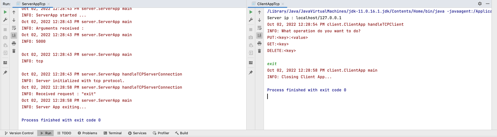

In UDP application, exit operation will only stop the client but server will keep running
indefinitely until interrupted/stopped by IDE controls like: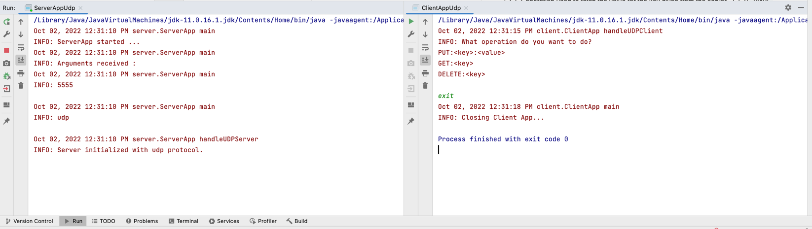

- To demo `timeouts` on the server, special input `wait` is present that will indicate the server to
  wait for 5 seconds which exceeds the default timeout in this application for a server to respond
  to client. If the input string contains `wait` as a part or only `wait` as input then this
  condition is invoked.
  In this case, for tcp connections, client logs Server timed out! then exits the program since it
  is an connection-oriented protocol. As a result server also exits since connection is broken now.
  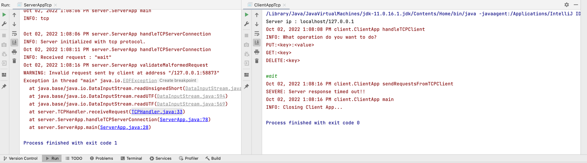
  For udp connections, client does not wait for server response as it has already timed out but
  continues to take further inputs and tries to send again to the server since it is a
  connectionless protocol.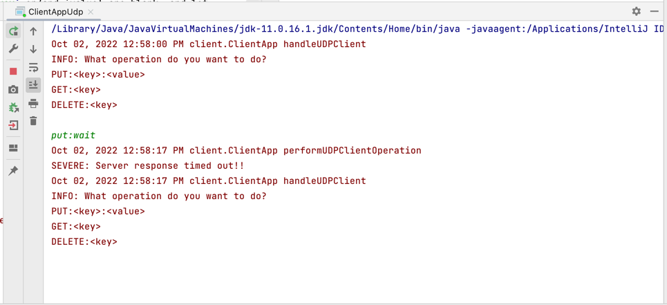
- If name of the operation inputted incorrectly like any other string then client
  validates and asks to enter input again.
- Client is expected to take in any string for a valid operation (GET, PUT, DELETE, exit, wait)
  then `key` and `value` as input and passes it to the server for validations or correct operations

### Operations supported by client

- Server will accept an input where `key` or/and `value` are not blank, and if blank then responds
  as Invalid Request!
  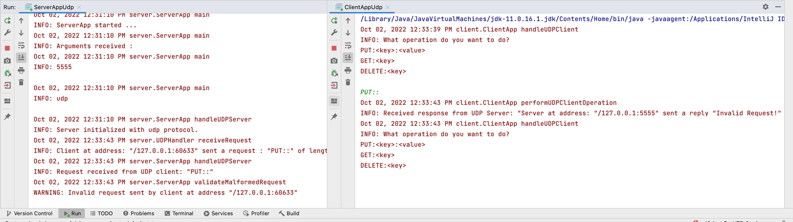
- Name of the operation needs to be in upper/lowercase as `PUT`, `GET`, `DELETE` followed by
  colon `:` and key and if value required.
- For `PUT`, `key` and `value` both are expected to be provided delimited by `:` else server will
  reject the request as Invalid Request!
  
- For `GET` , `key` is expected to be provided delimited by `:` else server will reject the request
  as Invalid Request!
  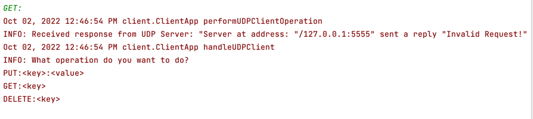
- 